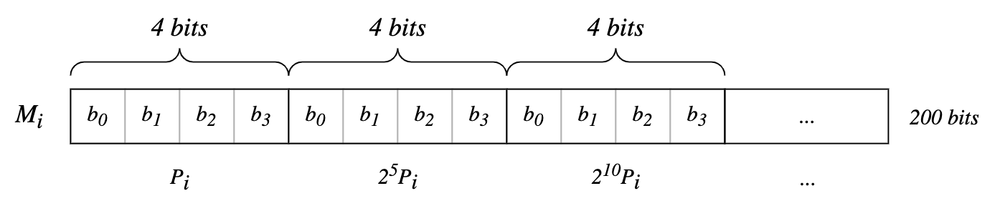

# Pedersen Hash Function

The Pedersen Hash Function provides a way to map fixed size tuples of elements from modular arithmetic onto elements of finit cyclic groups in such a way that discrete log relations between images are avoidable.

It's a bitwise hashig function that maps a sequence of bits to a compressed point on an elliptic curve. It's primarily used with arithmatic circuits of zero knowledge proof.

## Elliptic Curve

The elliptic curve forms over a prime finite field $\mathbb{F}_p$ with

$p=1888242871839275222246405745257275088548364400416034343698204186575808495617$

It's defined $E_m$ as the elliptic curve defined over $\mathbb{F}_p$

$$
E: v^2 = u^3 + 168698u^2 + u
$$

The order of $E_m$ is $n=8 \times r$, where

$r = 736030358979909402780800718157159386076813972158567259200215660948447373041$

is a prime number. Denotate by $\mathbb{G}$ the subgroup of points of orger $r$, that is,

$$
\mathbb{G} = {P \in E(\mathbb{F}_p) \mid rP = O}
$$

$E_m$ is birationally equivalent to the Edwards elliptic curve

$$
E: x^2 + y^2 = 1 + dx^2y^2
$$

where $d=9706598848417545097372247223557719406784115219466060233080913168975159366771$

Both decribe the same mathematical structure, but performing mathematical operations the addition is easier in the Montgomery form, but the memebers of this curves have a one to one correspondence between each other.

The translation map how to correspond to the points on this two curves is:

$$
    (x, y) \to (u, v) = \left(\frac{1+y}{1-y}, \frac{1+y}{(1+y)x}\right)
$$

$$
    (u, v) \to (x, y) = \left(\frac{u}{v}, \frac{u-1}{u+1}\right)
$$

## Pedersen Hash

To hash a sequence of bits $M$ to a geometric object first of all it's needed to generate a set of basis points from this points group, and this points are going to be used into the hash routine.

- $P_0, P_1, ..., P_k$ be uniformly sampled generators of $\mathbb{G}$ (for some specified integer $k$).

The bits are processed as, you have an input $M$, which is a sequence of bits, split into segments of 200 bits and each of those segments $M_i$ into 4 bits windows. Each basis point is used to processes one segment.

$$
M = M_0M_1...M_l \quad \text{where} \quad M_i=m_0m_1...m_k \quad \text{with} \quad
\begin{cases}
    k_i = 49     \quad \text{for } i=0, ..., l - 1, \\
    k_i \leq 49  \quad \text{for } i=l,
\end{cases}
$$

Let's just consider one segment $M_i$ of 200 bits sequence.

The way to reach the final hashed point is depending on the sequence of bits that are coming in, must be decided how many times are going to add this basis points to itself. Because the addition operation obscure the number of times that operation is performed so it will obscure the information that is the bits that are coming in.

<div align="center">

</div>

$M_i$ is 200 bits, splited into 4 bits windows obtaining a total of 50 windows. All the basis points goes through a variation when it comes to each window.

The first window will have the basis point $P_i$, the second window will have $2^5P_i$, so the $P$ will already have been added to it self 32 times. The third window will have $2^{10}P_i$, and so on so forth all the way to the 50th window.

The bits $b_0, b_1, b_2, b_3$ will be used to determine a final coefficient for the basis, and happnes for each variation of the basis point itself.

$$
\langle ... \rangle P_i \quad \langle ... \rangle 2^5P_i \quad \langle ... \rangle 2^{10}P_i \quad ...
$$

The specific coefficient determination is:

$$
enc(m_j) = (2b_3 - 1)\cdot(1 + b_0 + 2b_1 + 4b_2)
$$

- $(2b_3 - 1)$ determines the sign of the coefficient.

  $
  \begin{array}{l}
  b_3 = 0, \quad 2b_3-1 = 0-1 \\
  b_3 = 1, \quad 2b_3-1 = 1
  \end{array}
  $

- $(1 + b_0 + 2b_1 + 4b_2)$ This expression resolve a number from 1 to 8.

Once we have all the coefficients, we add the resulting points together.

$$
\langle M_i \rangle = \sum_{j=0}^{k_i-1} enc(m_j)\cdot2^{5j}
$$

And this returns the final hashing result for this segment.

$$
\langle M_i \rangle P_i = enc(m_0) P_i \quad + \quad enc(m_1) 2^5P_i \quad + \quad enc(m_2) 2^{10}P_i \quad + \quad...
$$

$\langle M_i \rangle$ determines how many times a basis point $P_i$ will be added to itself or substract depending on the sign of the coefficient.

We do this for each segment to reach the final point summing them all together.

So we define the Pedersen hash of M as

$$
H(M) = \langle M_0 \rangle \cdot P_0 + \langle M_1 \rangle \cdot P_1 + \langle M_2 \rangle \cdot P_2 + ... + \langle M_l \rangle \cdot P_l
$$

Because we are adding points on an elliptic curve over and over again, the result will also be a point on the elliptic curve.

# About this example

This is a basic test implementation of Pedersen hashing function.

## Running this example

### Requirements:

- [NodeJs](https://nodejs.org/)
- [Circom 2](https://docs.circom.io/getting-started/installation/)

### Usage

Into the main directory execute:

```
$ bash run.sh
```

### _Work in Progress..._
